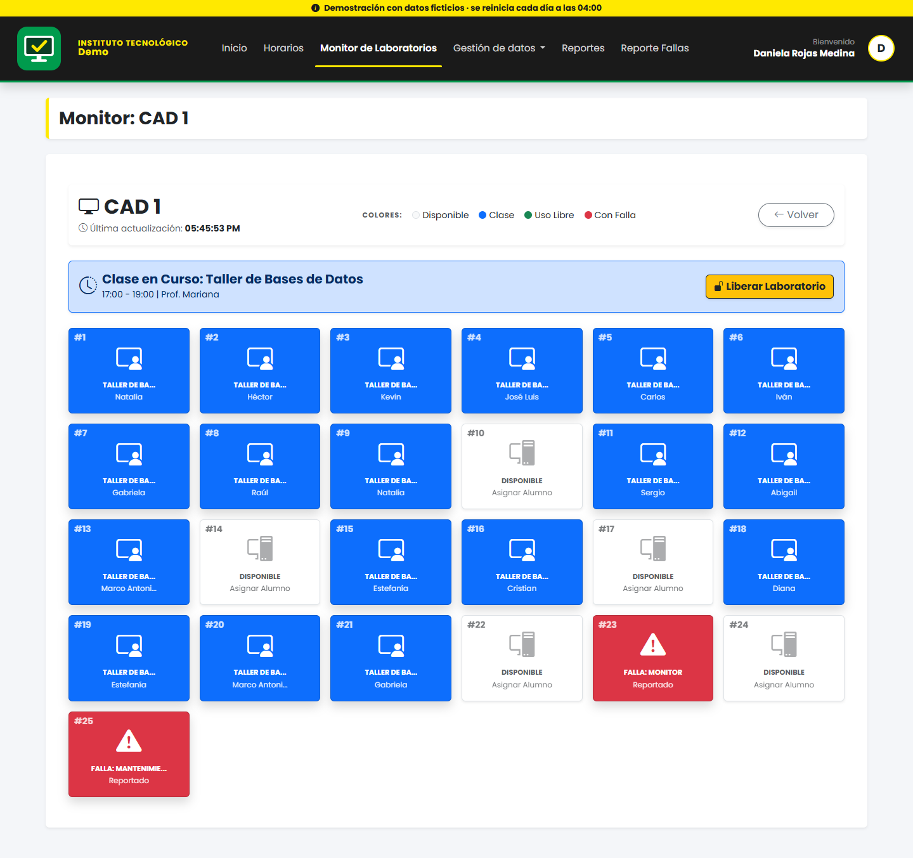
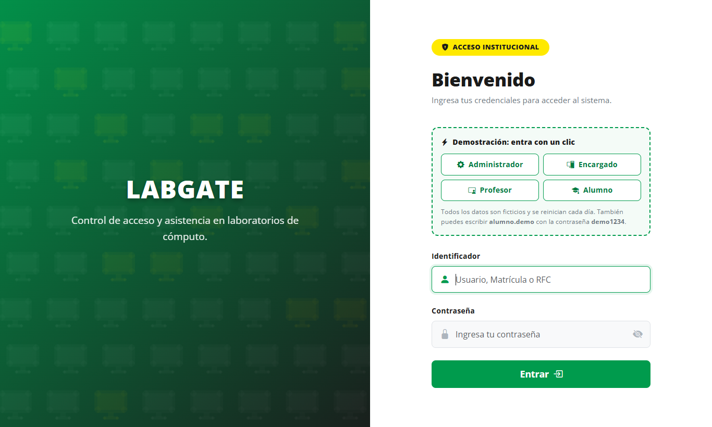
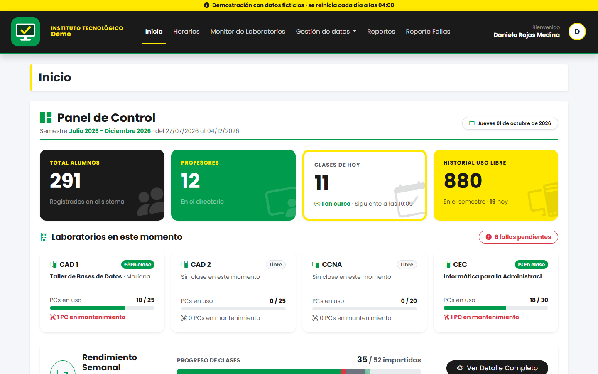
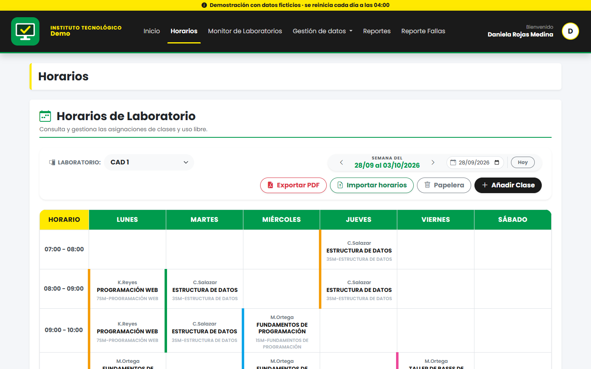
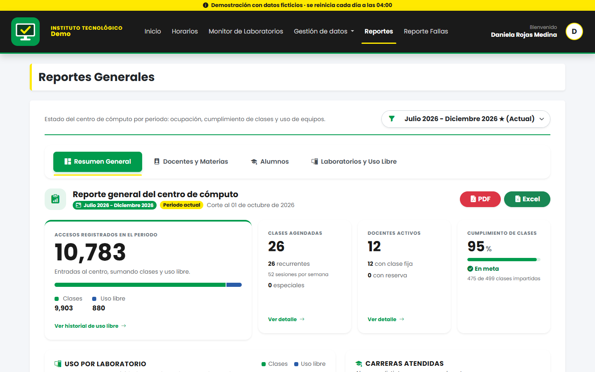
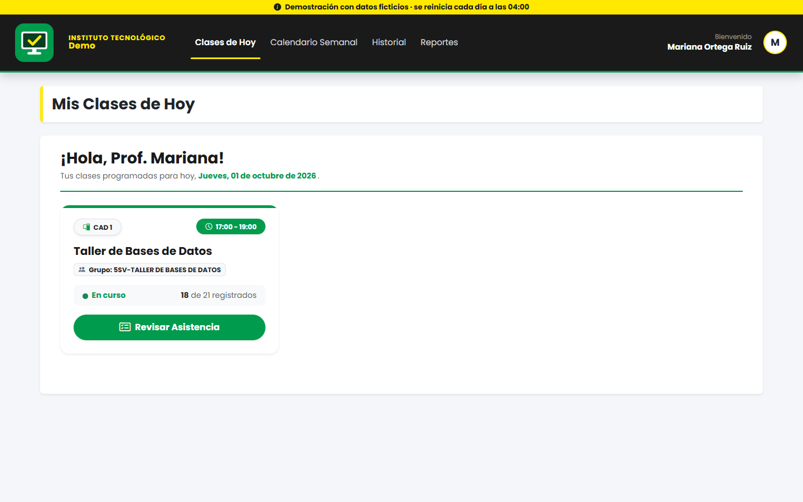
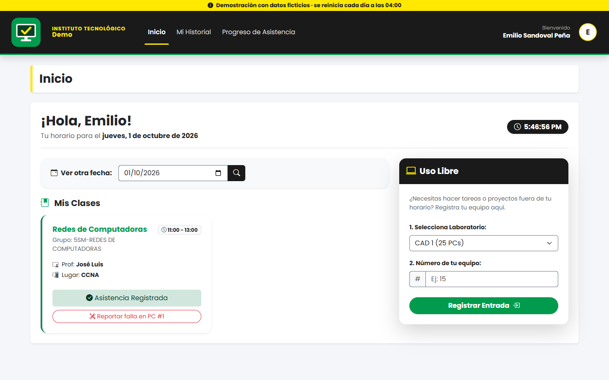
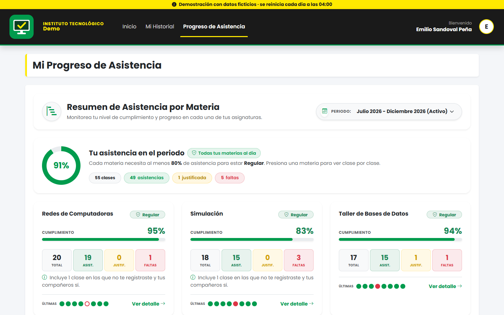
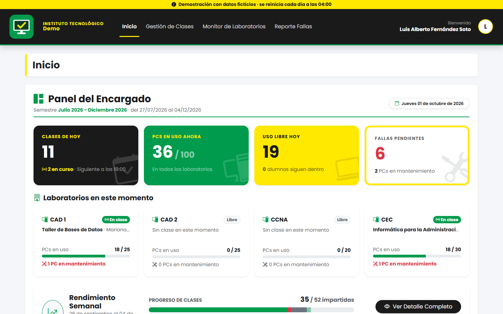

<div align="center">


# LabGate

**Access control and attendance for university computer labs**

Students check in on the PC they sit at, the PC unlocks, and staff see every lab live.

Live demo coming soon · [Español](README.es.md)

[](https://github.com/omar0910/labgate/actions/workflows/pruebas.yml)


</div>



## About

LabGate is the system I designed and built as my professional residency project
(the final-year industry placement of my Computer Systems Engineering degree).
It replaced paper sign-in sheets in the computer labs of a public university in
Mexico, where it runs in production for 4 labs and more than 1,000 user accounts.

This repository is the **demo edition**: the same code with a fictional
institution and generated data, so anyone can try it. No real names, student
records or infrastructure details are included.

**The problem it solves.** Lab attendance was taken on paper, nobody knew which
PCs were in use or broken, and there was no way to tell who had used a machine.
LabGate ties every session to a person, a PC and a time, and turns that into
live monitoring and reports.

## Try it

The live demo is being set up. Meanwhile you can [run it locally](#run-it-locally) and pick a role. One click, no sign-up:

| Role | Demo account | What to look at |
|---|---|---|
| Administrator | `admin.demo` | Dashboard, live monitor, schedules, reports |
| Lab manager | `encargado.demo` | Today's classes, fault reports, PC maintenance |
| Teacher | `profesor.demo` | Today's classes, taking attendance, class statistics |
| Student | `alumno.demo` | Check-in, free-use sessions, attendance progress |

Password for all of them: `demo1234`. The data is fictional and resets every
night. While the demo is up, a background job simulates the day: students check
in when a class starts and free-use sessions open and close, so the live monitor
always has something to show (class hours are Monday to Friday, 7:00–21:00,
UTC−7).

## Features

**Students**
- Check in to a class from the lab PC, or with their own laptop.
- Open and close free-use sessions outside class hours.
- Report a faulty PC in two clicks.
- See their attendance per subject, class by class.

**Teachers**
- See today's classes and who has checked in.
- Take or correct attendance, including justified absences.
- Weekly calendar, history and per-class statistics, exportable to PDF and Excel.

**Lab managers and administrators**
- Live monitor: every PC of every lab, who is using it and for what.
- Schedules with conflict detection (lab and teacher), plus one-off reservations.
- Smart Excel importers for students, teachers, groups and the full timetable,
  with a preview step that shows what will change before saving.
- Help desk for fault reports and preventive maintenance, with a usage counter per PC.
- Reports per teacher, subject, student, lab and career, in PDF and Excel.
- Weekly email summaries for teachers and students.

**Lab PC agent (Windows and macOS)**
- Keeps the PC locked on the sign-in page until the student checks in on *that* machine.
- Locks again when the session ends, and shuts the PC down after inactivity.
- Recovers on its own from network loss, power cuts and attempts to close it.

## Screenshots

| | |
|---|---|
|  Sign-in with one-click demo access |  Administrator dashboard |
|  Weekly schedule per lab |  Reports |
|  Teacher: today's classes |  Student: check-in and free use |
|  Student: attendance progress |  Lab manager: today |

## Technical highlights

A few parts I would point a reviewer to:

- **The lab agent** ([`scripts/centros-computo`](scripts/centros-computo)).
  A PowerShell script (about 2,400 lines) with an embedded C# low-level keyboard
  hook. It runs a kiosk browser, polls the server to know whether its PC has an
  active session, and handles the awkward cases: no network at boot, a power cut
  mid-class, a student killing the process. There is a Bash port for macOS.
- **Session rules on the server**
  ([`EquipoEstadoController`](app/Http/Controllers/Api/EquipoEstadoController.php),
  [`ReportesDeEquipos`](app/Support/ReportesDeEquipos.php)).
  A class check-in unlocks the PC only during the class (plus a grace period);
  a free-use session left open is closed when the PC stops reporting, and
  reopened if it turns out to be a network glitch rather than a shutdown.
- **Timetable importer** ([`PlanDeHorarios`](app/Support/PlanDeHorarios.php)).
  Compares an Excel timetable with what is already stored, matches labs,
  subjects and teachers by fuzzy name, remembers the user's corrections, and
  edits existing classes instead of recreating them so attendance is kept.
- **Absences without a record** ([`FaltasSinRegistro`](app/Support/FaltasSinRegistro.php)).
  A student who never checked in has no row to count. The system infers the
  absence only when the class really took place and the student was already
  enrolled.
- **Demo mode** ([`app/Demo`](app/Demo), [`ModoDemo`](app/Http/Middleware/ModoDemo.php)).
  A seeder builds a semester around today's date (about 290 students, 52 weekly
  class sessions with no clashes, 10,000+ attendance records), a simulator keeps
  the current day alive, and a middleware blocks the few actions that would
  break the demo for the next visitor.

## Stack

- **Backend:** PHP 8.1+, Laravel 10, MySQL 8, queues and scheduler
- **Frontend:** Blade, Bootstrap 5.3, Vite, SweetAlert2
- **Documents:** DomPDF (PDF), Laravel Excel (import and export)
- **Lab agent:** PowerShell 5.1 with C#, Bash for macOS

## Run it locally

Requirements: PHP 8.1+, Composer, Node 18+, MySQL 8.

```bash
git clone https://github.com/omar0910/labgate.git
cd labgate
composer install
npm install && npm run build

cp .env.example .env        # set DB_DATABASE, DB_USERNAME, DB_PASSWORD and DEMO=true
php artisan key:generate

php artisan migrate:fresh --seed --seeder=DemoSeeder
php artisan serve
```

Open http://127.0.0.1:8000 and sign in with any of the demo accounts above.

To keep the demo "alive" locally, run the scheduler in another terminal:

```bash
php artisan schedule:work
```

Useful commands:

| Command | What it does |
|---|---|
| `php artisan demo:reiniciar` | Wipes the database and seeds the demo again (only with `DEMO=true`) |
| `php artisan demo:simular` | Registers what is "happening" right now |
| `php artisan admin:crear` | Creates an administrator on a real installation |

## Tests

99 automated tests cover the rules that matter most: who can sign in and where,
class check-in, free-use sessions, what the server answers to each lab PC
(including power cuts and network glitches), schedule clashes, maintenance, the
search helper and the demo mode. They run against a real MySQL database, with
the clock frozen so results do not depend on when they run.

```bash
# once: create the test database (its name must end in _test)
mysql -u root -e "CREATE DATABASE labgate_test CHARACTER SET utf8mb4 COLLATE utf8mb4_unicode_ci"

php artisan test
```

They also run on every push with GitHub Actions
([workflow](.github/workflows/pruebas.yml)).

## Project layout

```
app/
  Demo/            Demo data generator and day simulator
  Http/            Controllers and middleware (roles, demo mode, lab PC detection)
  Imports/         Excel importers          Exports/   Excel exports
  Support/         Domain logic: attendance rules, search, timetable planning
config/marca.php   Name, institution and logos of the installation
scripts/           Lab PC agent for Windows and macOS, with install guides
tests/             Feature tests, one file per area of the system
```

The interface and the code comments are in Spanish, the language of the people
who use and maintain the system.

## Author

**César Omar Ramos Martínez** — Computer Systems Engineering student, Mexico.
[GitHub](https://github.com/omar0910)

© 2026 César Omar Ramos Martínez. Published for portfolio and review purposes.
